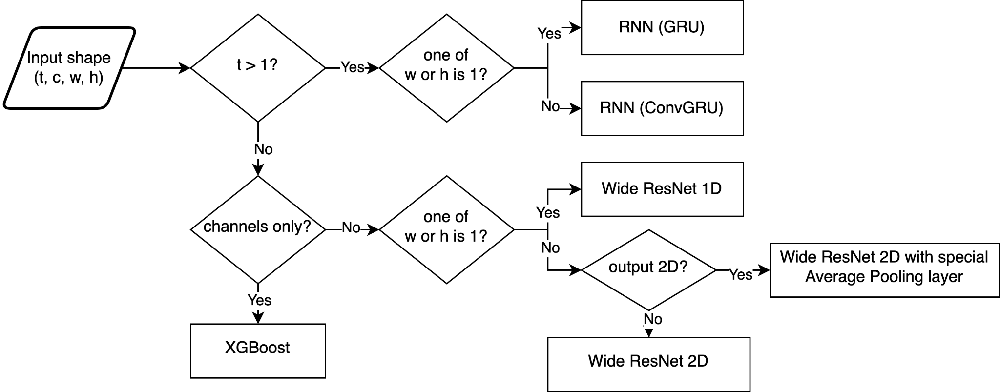

## NeurIPS AutoML Decathlon Competition 2022

This repository contains my final submission to the AutoML decathlon
competition which won 4th place. Access the competition page
[here](https://codalab.lisn.upsaclay.fr/competitions/6325).

This flowchart illustrates the model selection strategy:

Main rules I tried to follow:

1. Don’t overfit to the train tasks
    - Keep models simple.
    - Try not to look at the data.
    - Reduce the number of moving parts / isolate improvements.
2. Be wary of time and memory constraints
    - Check how much time you have left and stop training accordingly.
3. There is no free lunch
    - Inductive bias is important. Pick the right model class for every
      type of task.
